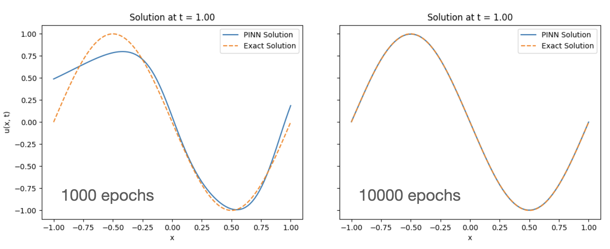

This simple code, created with a very simple prompts given to Gemini, uses a Physics-Informed Neural Network to "solve" the linear, scalar advection equation

$$\frac{\partial \bf q}{\partial t} + a{\partial \bf q}{\partial x} = 0$$
where $$a$$ is a constant speed.

It is a toy code for educational purpuses only although it can be very easily modified and extended to do science with it.

Contact me if needed: smarras@njit.edu

## 1. Create and activate python environment
```
python3 -m venv myenv
source ./myenv/bin/activate
```

## If not already done so, install torch, numpy, and matplotlib:
```
pip3 install torch
pip3 install numpy
pip3 install matplotlib
```


## Sample equation

## Examples


