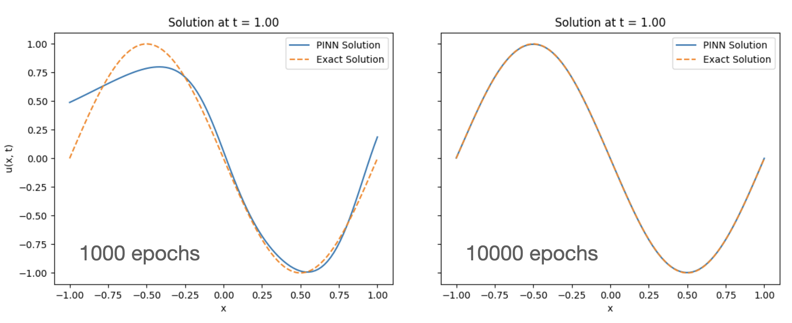

This simple code, created with a very simple prompts given to Gemini, uses a Physics-Informed Neural Network to "solve" a linear, scalar partial differential equation.

It is a toy code for educational purpuses only although it can be very easily modified and extended to do science with it.

Contact me if needed: smarras@njit.edu

## 1. Create and activate python environment
```
python3 -m venv myenv
source ./myenv/bin/activate
```

## If not already done so, install torch, numpy, and matplotlib:
```
pip3 install torch
pip3 install numpy
pip3 install matplotlib
```

## Examples
1D scalar and linear advection equation
$$\frac{\partial u}{\partial t} + a\frac{\partial u}{\partial x} = 0$$
where $$a$$ is a constant speed.

The initial condition for the results below is a `u=sin(x)`.
In the figure, solutions obtained with 1000 (left) and 10000 (right) epochs:


Whereas the following figure uses only 1000 epochs (like the left one above, but 5 neuron layers instead of 3:
