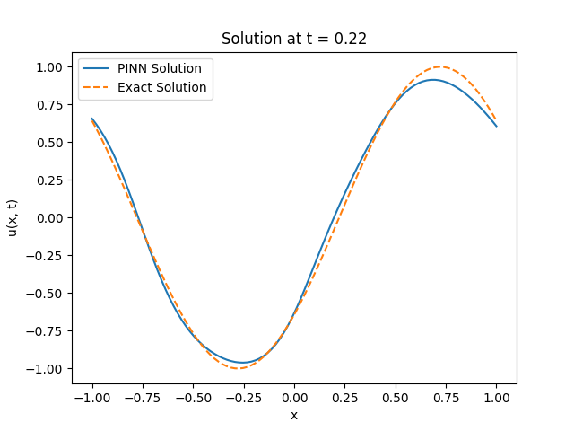

## 1. Create and acrivate python environment


```
python3 -m venv myenv
source ./myenv/bin/activate
```

## 2. If not already done so, install torch, numpy, and matplotlib:
```
pip3 install torch
pip3 install numpy
pip3 install matplotlib
```

## Examples
- 1000 epochs


- 10000 epochs
