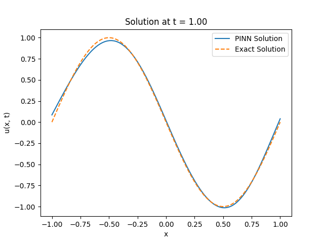
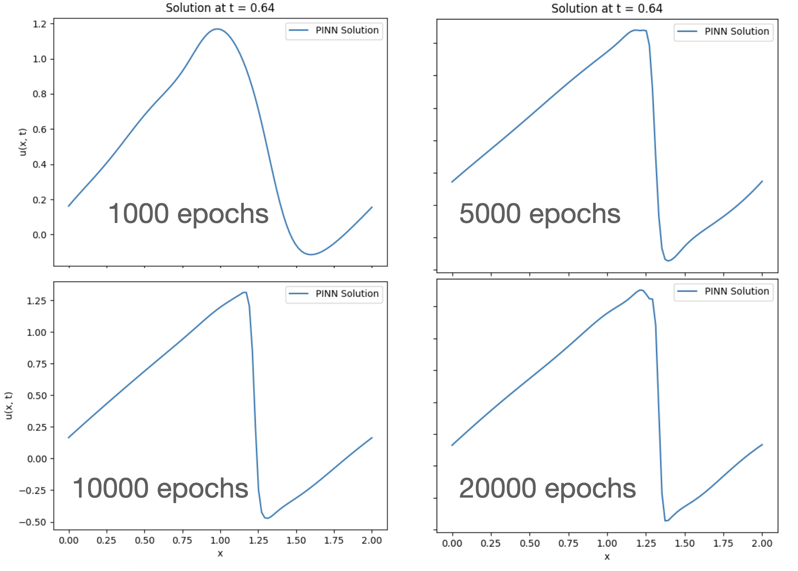

This simple code uses a Physics-Informed Neural Network to "solve" simple linear and non-linear partial differential equations.

It is a toy code for educational purpuses only although it can be very easily modified and extended to do science with it.

Contact me if needed: smarras@njit.edu

## 1. Create and activate python environment
```
python3 -m venv myenv
source ./myenv/bin/activate
```

## If not already done so, install torch, numpy, and matplotlib:
```
pip3 install torch
pip3 install numpy
pip3 install matplotlib
```

## Run the code:
```
python3 mypinn.py
```

## Examples
1. 1D scalar and linear advection-diffusion equation
$$\frac{\partial u}{\partial t} + a\frac{\partial u}{\partial x} - \alpha\frac{\partial^2 u}{\partial x^2} = 0$$
where $$a$$ is a constant speed and $$\alpha$$ is a constant diffusivity.

The initial condition for the results below is a `u=sin(x)`.
In the figure, solutions obtained with 1000 (left) and 10000 (right) epochs:


Whereas the following figure uses only 1000 epochs (like the left one above, but 5 neuron layers instead of 3:


2. Non-linear inviscod Burgers equation
$$\frac{\partial u}{\partial t} + u\frac{\partial u}{\partial x} = 0$$ with initial conditions $$u=sin(\pi x) + 0.5 and periodic boundary conditions on \Omega = [0, 2]. The solution in the figure is plotted at t=2/\pi.



